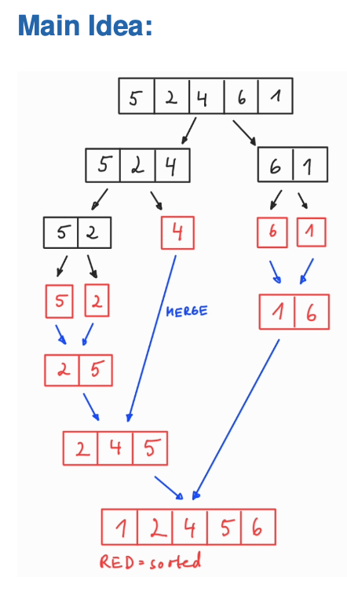

### 🧠 Merge Sort Algorithm

The goal of this project is to implement an efficient **Merge Sort** algorithm to sort arrays with a time complexity of **O(n log n)**.

We begin by creating a **merge procedure** that merges two pre-sorted subarrays. This is accomplished using an auxiliary function `Merge(A, p, q, r)`, where:
- `A` is the array to be sorted.
- `p`, `q`, and `r` are indices such that `p ≤ q < r`.

The procedure assumes that the subarrays `A[p..q]` and `A[q+1..r]` are already sorted. It merges them into a single sorted subarray, which replaces the original section `A[p..r]`.

The runtime is O(N).

---

###  Recursive Sorting

After defining the merge operation, we apply **recursion** to divide the entire array into smaller subarrays. We recursively sort each half and then merge them using the procedure above. This divide-and-conquer approach ensures efficient sorting even for large datasets.

